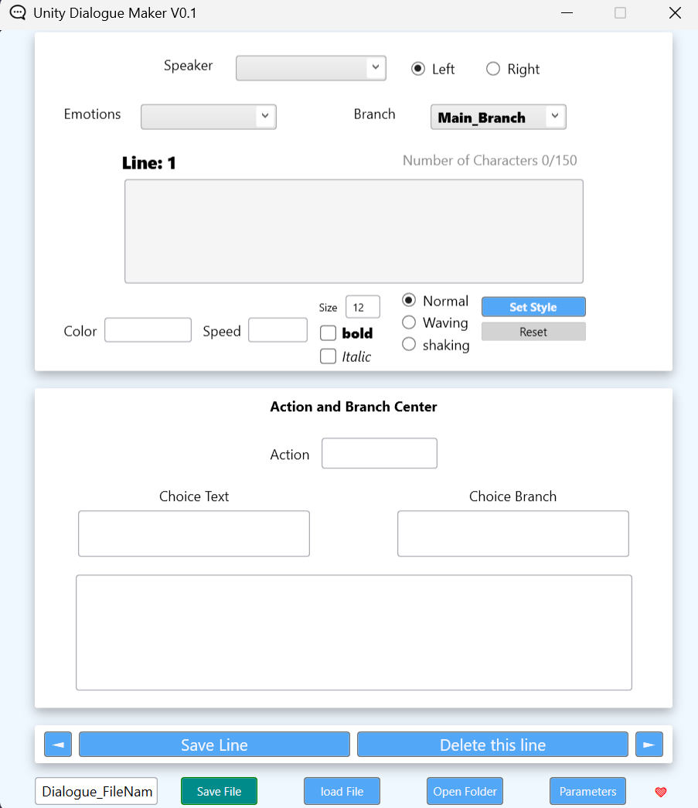

# 🎭 Dialogue Maker (Windows App for Writers)

**Dialogue Maker** is part of a two-part system designed to improve collaboration between **writers** and **programmers** in game development.  
This Windows application (built with **WPF**) allows non-programmers — especially writers — to easily create, organize, and export dialogue data for Unity projects.  

---

## 🧩 Overview

This tool lets writers define:
- **Characters (Speakers)**
- **Emotions**
- **Dialogue Styles** (color, speed, size, etc.)
- **Actions & Events**
- **Branching Dialogues**

All of this is saved in a structured **.json** format that programmers can directly use inside Unity.

---

## ⚙️ 1. Parameters

Before writing dialogue, the user must define their **parameters**.

Click the **Parameters** button to open the parameters folder.  
You’ll find **two `.txt` files**:

### 🗣️ `Speakers.txt`
List of all speakers in your story.  
Use the following format:

clay

floy

rez ###

> The symbol `###` marks the **main character**.  
> By default, this character’s dialogue appears on the **left side** (you can change this later).

### 😊 `Emotions.txt`
Define emotional states your characters can express:

nothing

happy

confuse

sad

You can add as many as you want — each will be selectable during dialogue creation.

---

## 🎨 2. Style Section

Writers can visually customize dialogue appearance and pacing.  
Select the text you want to style, then apply one or more of these options:

### 🎨 Color Style
Set text color by **name** or **hex code**:

color: blue
color: #FFDE21

### 🕐 Speed Style
Control how fast each word appears (measured in seconds per word):

speed: 1 → Each word appears every 1 second (this is so slow for dialogue)
speed: 0.01 → Faster (good for skip dialogue)

**defualt speed:0.05**

> 💡 Tip: To create a “pause,” apply speed (like speed:5) to a **space character before the next text**.

### 🔠 Size Style
Adjust text size (default is `12`):

size: 18 → larger text
size: 10 → smaller text

### 🖋️ Font Style
Make parts of dialogue bold or italic:

This is italic text.
This is bold text.

### 🌀 Animation Style

You can apply animations to text for more expressive dialogue.  
Supported types include **Shake** and **Wave** animations.

#### 🔹 Shake & Wave Animation
Used to show strong emotions like anger or shock.
and Use wave for create smooth, friendly, or magical text movement.

Example:

**Preview (GIF placeholder):**  

---

## ⚡ 3. Action System

**Actions** are special markers that trigger in-game events at the **end of a line**.  
They are **case-sensitive**, so make sure to type them exactly as intended.

Example:

I found the key! [Action: UnlockDoor]

In Unity, the programmer can catch the `UnlockDoor` event and make something happen in the game (like opening a door).

> 🧠 Writers don’t need to code — just define the action name. Programmers will handle what happens next.

---

## 🌳 4. Branching System

Dialogue Maker supports **branching** — letting the story change based on player choices.

### 📚 Default Branch
Every project starts with a `main_branch`.

### ➕ Adding Branches
When you create a new branch (for example, `branch_angry`, `branch_calm`), the current branch is replaced with the new ones.

**Example:**
If you make 3 new branches from `main_branch`,  
→ the original `main_branch` will now split into those 3.

### ⚠️ Deleting Branches
Be careful when deleting a branch!

If you delete a branch that’s already used in dialogue:
- All lines connected to that branch will **lose their link**.
- You’ll need to **manually reassign** those lines to a new branch.

Example:
If `branch_hello` is deleted but 3 lines were using it,  
→ those lines will lose their branch connection and must be reassigned. 
branch name automatically set in this order : branch_<the number of line>_<the number of brancher>

---

## ✂️ 5. Line Management

- **Next / Previous**: Navigate between dialogue lines.
- **Delete Line**: Permanently removes the selected line.

> ⚠️ If the deleted line contained a **branch**, all connected branches will also be removed.  
> This follows the same rule as the branching section above.

---

## 💾 6. Save & Load

Your entire project (dialogue, parameters, styles, and branches) is stored in a **`.json`** file.  
You can **Save** or **Load** your project at any time.

- **Save** → Exports to `.json`
- **Load** → Opens any valid Dialogue Maker `.json` file

---

## 🧠 Tips for Writers

- Define all speakers and emotions before writing — it prevents data loss.
- Use clear and consistent branch names.
- Test your dialogue flow frequently.
- When in doubt, communicate with your programmer — this system is built for teamwork.

---

## 🖥️ Built With

- **WPF (Windows Presentation Foundation)**
- **C# (.NET Framework)**

---

## 📁 Output Format

Generated files:

dialogue_project.json
Speakers.txt
Emotions.txt

These files are ready for direct integration with the **Unity Dialogue Maker Plugin**.

---

## 👤 Author

**Rez** – Programmer / System Designer  
🎮 Focused on bridging the gap between writers and developers for faster, cleaner, and more creative narrative workflows.